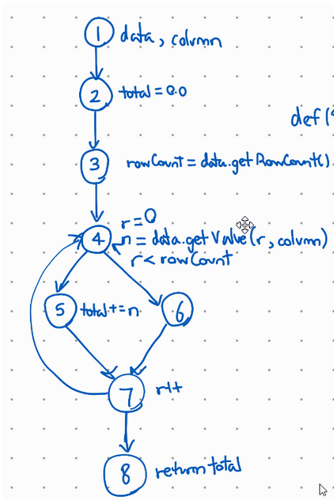
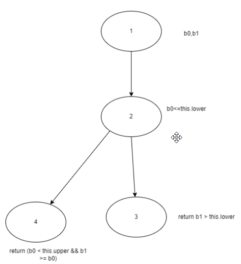

**SENG 438 - Software Testing, Reliability, and Quality**

**Lab. Report #3 – Code Coverage, Adequacy Criteria and Test Case Correlation**

| Group \#:      |   2  |
| -------------- | --- |
| Student Names: |     |
|         Kyle Hasan     |     |
|         Andres Caicedo    |     |
|         Evyn Rissling       |  30096936   |
|         John Abo      |     |

(Note that some labs require individual reports while others require one report
for each group. Please see each lab document for details.)

# 1 Introduction

The purpose of this lab is to do white box coverage unit testing using Eclipse’s EclEmma on the same software as the previous lab. Testing coverage was given more importance as we tried to increase the line coverage, method coverage and branch coverage for the DataUtilities and Range classes. Eclipse EcclEmma was used to do the coverage whitebox testing. 

# 2 Manual data-flow coverage calculations for calculateColumnTotal (2 argument version) and intersect methods

## calculateColumnTotal ##
### Data Flow Graph ###

### def-use sets: ###
  def(1) = {data, column}, use(1) = {}  
  def(2) = {total}, use(2) = {}  
  def(3) = {rowCount}, use(3) = {data}  
  def(4) = {n, r}, use(4) = {data, r, rowCount, column}  
  def(5) = {total}, use(5) = {total, n}  
  def(6) = {}, use(6) = {}  
  def(7) = {r}, use(7) = {r}  
  def(8) = {}, use(8) = {total}  

### du-pairs: ###
  1. du(1, 3, data) = [1, 2, 3]
  2. du(1, 4, data) = [1, 2, 3, 4]
  3. du(1, 4, column) = [1, 2, 3, 4]
  4. du(2, 5, total) = [2, 3, 4, 5]
  5. du(2, 8, total) = {[2, 3, 4, 5, 7, 8], [2, 3, 4, 6, 7, 8]}
  6. du(5, 8, total) = [5, 7, 8]
  7. du (3, 4, rowCount) = [3, 4]
  8. du(4, 7, r) = {[4, 5, 7], [4, 6, 7]}
  9. du(4, 5, n) = [4, 5]

### Pair-coverage ###
All tests except for the Singleton and Table out of bound tests, and the InvalidParameter test cover all pairs. The OutOfBOund tests cover all pairs but 4, 6, and 9, while the InvalidParameter test does not cover any pairs.

### Test Coverage ###
Since all pairs were covered, so were all the uses. This means that the calculateColumnTotal method has 100% data-flow coverage.

## Range.intersect ##
### Data Flow Graph ###

# 3 A detailed description of the testing strategy for the new unit test

Our test strategy consisted of checking the initial 

# 4 A high level description of five selected test cases you have designed using coverage information, and how they have increased code coverage

Range.combine(): Combine method was tested using different ranges with differing signs and magnitudes. The method helped cover 7 lines for the line coverage, as well as 4 branches and of course a method coverage increase as well.  
Range.expand():  This test used multiple values to test the expansion of a range object, including a null test as well. This increased the method testing by 1 and the line coverage testing by 8 and the branch coverage was increased by 2 more branches.
Range(): This is testing the default constructor for the Range class. This test increases the line coverage by 8 lines as outlined in the detailed report. The branch coverage was increased by 2 and the method coverage was also impacted by 1 more method being tested. 
Range.equals(): Equals method was tested using some specific range object created in the setup. This helped us increase line coverage by 8 as well as increasing branch coverage by 6. The method coverage was also increased by 1. 
Range.constraint(): This method was tested with specific Ranges as well as specific values to make sure the constraint of every range was tested. This test increased line coverage by 8 lines and branch coverage by 5 .The method coverage was also increased by 1. 

# 5 A detailed report of the coverage achieved of each class and method (a screen shot from the code cover results in green and red colour would suffice)

Range Line Coverage: 90.3%

Range Branch Coverage: 91.7%

Range Method Coverage: 82.6%

DataUtilities Line Coverage: 98.8%

DataUtilities Line Coverage: 95.8%

DataUtilities Line Coverage: 90.0%

# 6 Pros and Cons of coverage tools used and Metrics you report

The coverage tool we used was EclEmma which was very good at organising the coverage tests as shown above. This made it easier to figure out how many tests we needed to write to meet the requirements for this assignment. The only con we experienced was a synchronisation issue with the workspace by Eclipse where some libraries were not imported correctly and so we had to manually adjust this. 

# 7 A comparison on the advantages and disadvantages of requirements-based test generation and coverage-based test generation.

Requirement based testing has the advantage of being time-boxed and well defined which makes the testing easier to plan. The drawback of requirement based testing is that it can miss some important parts of the software quality. It has the possibility of being too brief to test properly. Coverage based testing is better in this sense since it has to create additional test cases to increase coverage of the functionalities making it harder to miss the bugs in the software. It also helps in determining a quantitative measure of code coverage, which indirectly measures the quality of the software. The drawback of the coverage testing is that it does not scale with the software so that if a specified function has not been implemented or a function was omitted from the specification, then we can’t say anything about them; it only looks at a structure which is already there.

Requirements-based testing does not guarantee that all possible cases have been covered, even with high coverage on multiple metrics, there still may be an edge case unaccounted for. The benefits are that you don’t need access to the source code to see how much of the system you have tested and gives you a better idea of where to focus test cases. It also lets the tester keep track of what’s been tested.

# 8 A discussion on how the team work/effort was divided and managed

Each individual was given 3 methods to write unit tests for. The group later met to combine everything,make sure the test suite met requirements and write the report.

# 9 Any difficulties encountered, challenges overcome, and lessons learned from performing the lab

With more practice we became more proficient with JUnit testing, the eclipse IDE and coverage tools. 

# 10 Comments/feedback on the lab itself

Still hate Eclipse…
